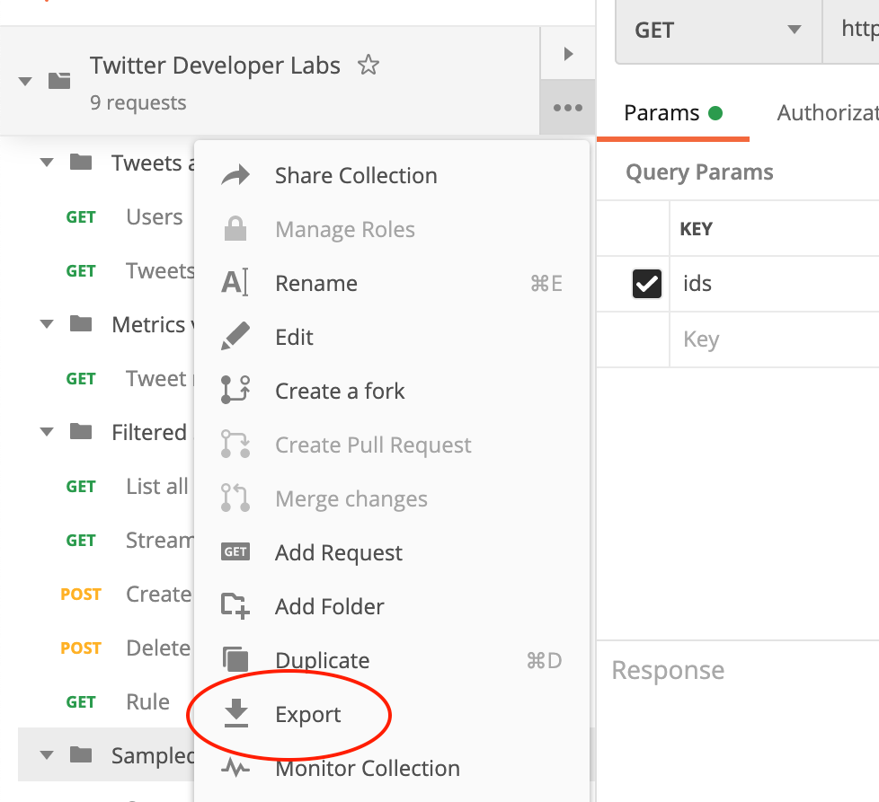
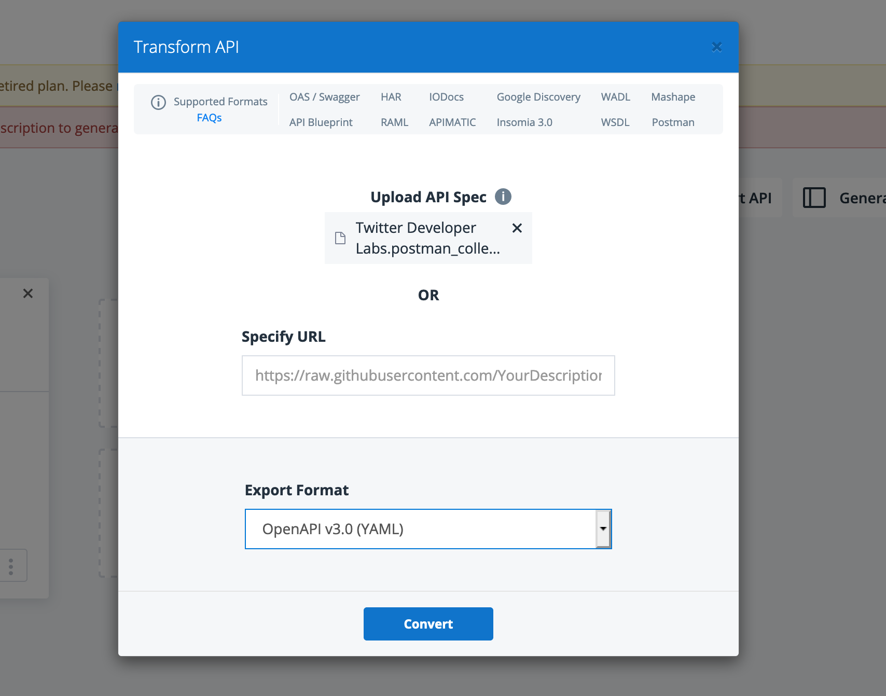

# Migrating from Postman

## Introduction

Stoplight Platform supports all sorts of workflows for API design and documentation: Design-First and Code-First being the most common. Design First suggest teams are creating API descriptions in description formats like OpenAPI and JSON Schema, and writing code that corresponds to that description later. Code-First suggests teams are creating all the code first, then writing API Reference documentation later somehow, either in Google Docs, Spreadsheets, a Content Management System, Postman Collections, or OpenAPI based toolng.

If your organiation is moving from code-first to design-first, you might be faced with the prospect of manually creating OpenAPI for every single request and response for every single API, and that is not an exciting prospect, so it's common to try and find shortcuts. 

One way of doing that is to find the largest trove of this information, and convert it to OpenAPI. One such source of information is a Postman Collecton. Postman is a popular HTTP client with some other handy functionality built on top, which developers often keep up to date during their development process and sync over Postman Cloud to share those updates with teammates. 

This Postman Collection can be converted into am API description, which can then be expanded with more useful information as you go.

## How do I migrate?

Postman can Inport OpenAPI, but there is no Export OpenAPI featue for Postman Collections. 

> [Import Postman Collections is on our roadmap](https://roadmap.stoplight.io/c/48-support-for-postman-collections), please vote for that feature if it is of interest to you. 

There are a few tools around for converting Postman to OpenAPI or back again, and whilst many of them do not work very well, one works like a charm: [Apimatic Transformer](https://www.apimatic.io/transformer/).

### Converting Postman Collections to OpenAPI

First of all you'll want to add examples to all the requests and responses in the Postman Collection if you've not done that already. 

Postman Collections do not contain any information about the "schema" (a.k.a Models). Instead the conversion process will infer what it can from whatever examples you've added. Make sure your examples are up-to-date and as close to realistic as possible before running the conversion.



Now export the Postman Collection by clicking on the "..." icon on the sidebar. You'll be asked which Postman Collection version should be used for the export, and "2.1" is fine. 

Click "Export" again and save the file anywhere you like.

Sign up for [Apimatic Transformer](https://www.apimatic.io/transformer/), it's free. 

Next, use their [Transformer tool](https://www.apimatic.io/dashboard?modal=transform) to upload the exported Postman Collection JSON file. You'll see a dropdown asking which format the Transformer should export to, and you should select "OpenAPI v3.0 (YAML)" (or JSON if you like, but it's best to stick to v3.0). 



When exporting the [Twitter Developer Labs](https://developer.twitter.com/en/docs/labs/overview/introduction) Postman Collection, the file was named `Twitter Developer Labs.postman_collection.json`.

_Repeat these steps for each of the Postman Collecitons you want to migrate, and save all the OpenAPI documents in a folder ready for importing to Stoplight._

### New Stoplight Workspace

Now, let's create a Stoplight Workspace and add your projects.

1. [Create](https://stoplight.io/welcome/create) your new [Stoplight Workspace](../2.-workspaces/a.creating-a-workspace.md).
2. Please follow this [step-by-step guide](../1.-quickstarts/add-projects-quickstart.md#connect-an-existing-git-project) to connect your VCS account and add your new projects.

### Importing OpenAPI to Stoplight

API Descriptions can live in with source code, or in totally seperate projects, it's up to you. 

Assuming you'd like the API description to live in the same prohect as the code its using, open that project in Stoplight Platform, then click "Edit in Studio".

Add a new API with the "+" icon.

Hit the "Import Existing" button, then upload the OpenAPI document which was downloaded from Apimatic Transformer. The example collection we've been working with was called `Twitter Developer Labs.postman_collection.json-OpenApi3Yaml.yaml` and Stoplight placed it in the `reference/` directory (you can [configure Stoplight](../2.-workspaces/c.config.md) to place APIs elsewhere).

Finally, give that file a new name that's a little shorter: `reference/developer-labs.yaml` or something like that. Now we can play around in Studio to add any missing information.

Quite often you will see parameters described with text like this:

```yaml
- name: format
  in: query
  description: >-
    Format for all the objects returned as part of the response, including expansions.


    Allowed values: default, compact, detailed

    Default value: default
```

Instead of having all that mushed in as text, which may or may not have a consistent layout across various APIs written by different people, you can turn that into proper OpenAPI, either through the Code view, or the Form view. 

Either way, the finished product could look like this instead:

```yaml
- name: format
  in: query
  description: >-
    Format for all the objects returned as part of the response, including expansions.
  enum:
    - default
    - compact
    - detailed
  default: default
```

There's all sorts of other stuff that can be improved, and Studio should let you know all about them, using the [Spectral OpenAPI ruleset](https://meta.stoplight.io/docs/spectral/docs/reference/openapi-rules.md).

### Invite Your Team

The fastest way to get your team moved over to Stoplight Platform is to [configure an email domain](../2.-workspaces/d.inviting-your-team.md#make-your-workspace-discoverable) and share a link to your workspace's signup page. 

Alternatively, you can also [invite members](../2.-workspaces/d.inviting-your-team.md) individually using their email.

### Migrating Documentation

If you have been using Postman Documentation then you'll be pretty at home with Stoplight Documentation. Pushing to your Git repo will [automatically publish](../2.-workspaces/g.automating-publishing.md) changes to Documentation, Mock Servers, and update Explorer and your shared Design Libraries. 

No work required on your part, just set up the permissions and share your workspace or project with other people via the same URLs you're looking at them with. Those URLs probably look like:

```
https://{workspace}.stoplight.io/docs/{project}
```

If you have any trouble, click the Support icon in the user menu and we'll help you out!


