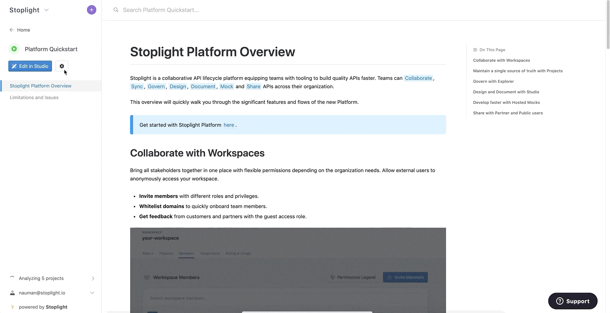
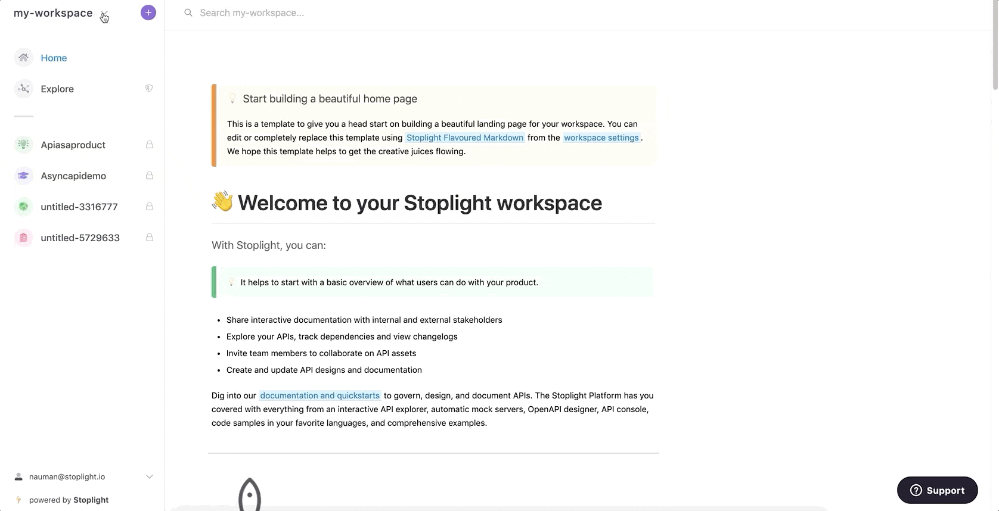
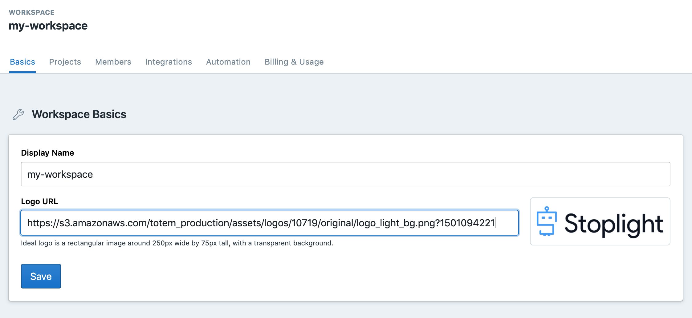

# Share Documentation

With your project ready, you can share the documentation with internal and external stakeholders. Your workspaces are your developer hub, viewable by anonymous, guest, and internal users. Users would see different projects depending on their permissions and project visibility settings. 

To update the visibility settings for a project, navigate to the `Manage Access` tab in the project settings screen using the cogwheel beside the `Edit in Studio` button.

## Public Documentation

Under the visibility section, set the project visibility as `Public`. This would allow everybody, including anonymous users, to view this project. 

## Internal Documentation

Under the visibility section, set the project visibility as `Internal`. This would allow everybody in the workspace to view the project. 

## Partner Documentation

Under the visibility section, set the project visibility as `Internal` or `Private`. Next, give guests or partners access to the project documentation by adding them in `Members with Direct Access` section. 

If the project is set to `Internal`, everybody in your workspace and users are given direct access would be able to view the documentation. If it's `Private`, only users with direct access would be able to view the documentation. 

## Create a Landing Page

The Home Screen would be the landing page for users landing on the documentation. This can be used to highlight important APIs, getting start guides, or give a quick overview of the API platform. 

There's a template available to get you quickly started. You can edit or completely replace the default template using [Stoplight Flavoured Markdown](https://stoplight.io/p/docs/gh/stoplightio/studio/docs/Documentation/03a-stoplight-flavored-markdown.md) from the workspace settings.

## Add Company Logo

In the workspace settings, add a URL to your logo. It's recommended to use a logo with the company name. 

## Share with Users

With your landing page ready, and projects set to the correct visibility, share the link to your workspace with external users to let them access the documentation. For internal team members [invite them](../1.-workspaces/d.inviting-your-team.md) to the workspace. 