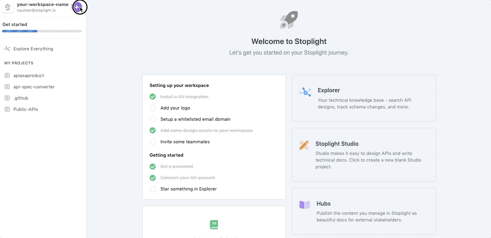
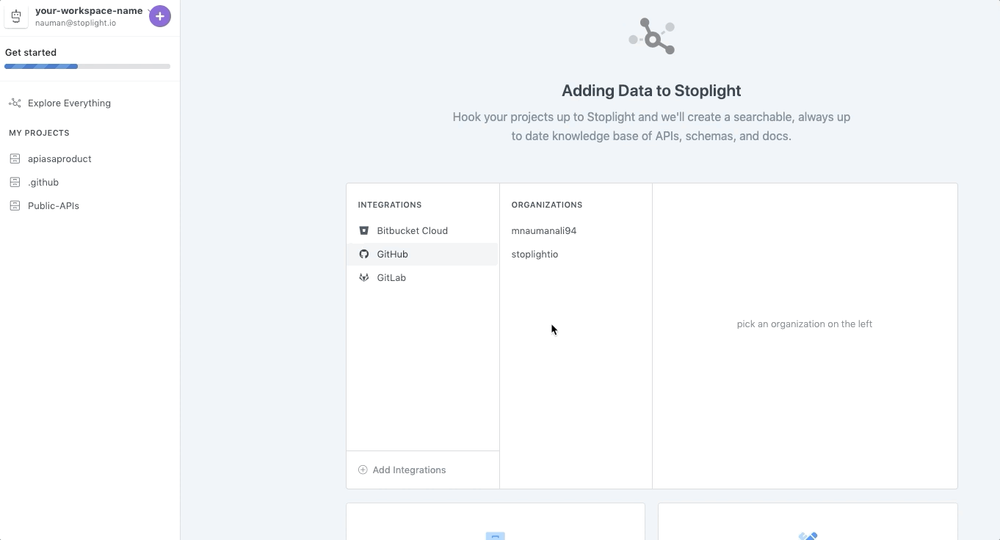

# Adding Projects

Within Workspaces, the most important concept in Stoplight is "Projects". Projects are a place for you to manage APIs, articles, and any other files that you want to store together. 

## What is a Project

Projects in Stoplight are usually associated with a Git repository, which can contain anything you would expect to find in a repository: source code, API descriptions, images, Markdown articles, maybe some excel spreadsheets. Stoplight will analyze the contents of a project looking for things it knows what to do with, and ignore the rest.

Stoplight looks for: 

- API Description Documents (OpenAPI v2, OpenAPI v3, and JSON Schema)
- Markdown articles
- Images

Different types of projects will contain different combinations. Here are a few possible ways projects might be used:

1. **An open-source library:** JavaScript code and Markdown articles.
2. **A REST API:** PHP source code, API Descriptions written in OpenAPI, and Markdown for "How To" instructions.
3. **Community Contributed Documentation:** Markdown articles, but source code is hidden in another repository.

When designing an API, you can start with the API descriptions before the API even exists, then add the source code later, and any changes to the API can be made in the same pull request as the changes to the code. 

## Adding projects from your Git Provider

The quickest and recommended way to get projects into Stoplight is to pull them in from Git, and this can be done in Explorer. 

<!--Stoplight platform is powered by your organization's Git provider (GitHub, GitLab, BitBucket e.t.c) ` No vendor lock in or unfamiliar tooling ;)`. Your API teams can collaborate on projects across your organization using the tooling they are familiar with, maintaining a single source of truth for their API artifacts. You can use your provider to maintain roles and permissions on different projects. -->

1. Login to your workspace and navigate to **Explorer**
2. Click on **Add projects from your Git Provider** and choose the Git provider of your choice. Next click on **Connect with *Your Git Provider**`. Follow the instructions on the pop up screen to authenticate.
    > If your git provider isn't listed or you're using on-premise versions of a git provider lets get you setup [here](../5.-integrations/a.integration-with-git.md). 

5. Upon successful authentication, you should see your organizations listed. Choose the organization, and select the repositories you want to import. Click **Add Projects**.

If the repository has Markdown articles, or API descriptions, then you will see them show up once the analyzer is finished running. If not, you can start to [create this content](#brand-new-project) in your file system, by using Studio to create a new API,or Markdown content.

## Brand New Projects

Using [Studio](../3.-design/a.overview.md) you can create and edit the contents of your projects, and push changes back to the Git repository when you're done. 

## Projects without Git

Git is very popular, but not used by everyone. If a different version control system is in use like Mercurial, SVN, SourceSafe, Bazaar, or your team uses another way to keep all their work organized, Stoplight has you covered.

[Stoplight CLI](#TODO Publishing via CLI) is a command-line tool, built as a NPM module, which can publish changes to Stoplight, and have them show up in Explorer just like any other project. They won't be editable in Studio, but the content will be available to read and search like anything else. 
